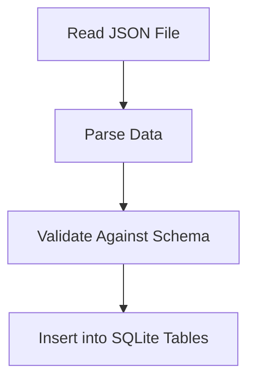

### Data Structure and Plan for Importing JSON to SQLite Database

#### **1. Overview of Data Structure**
The database schema provided is designed to store all available Pokémon TCG data in a normalized relational structure. It mirrors the JSON data from the `pokemon-tcg-data` repository, ensuring that no information is lost during the import process. Below is a summary of the key tables and their purposes:

| **Table Name**           | **Purpose**                                                                 |
|--------------------------|-----------------------------------------------------------------------------|
| `cards`                 | Stores core details of individual Pokémon cards (e.g., name, HP, rarity).  |
| `card_sets`             | Represents sets of cards, including metadata like release dates.           |
| `card_subtypes`         | Captures subtypes for cards (e.g., "Basic", "Stage 1").                     |
| `card_types`            | Tracks elemental types (e.g., Fire, Water).                                |
| `card_attacks`          | Stores attack details (e.g., name, cost, damage).                          |
| `card_abilities`        | Contains abilities associated with cards.                                  |
| `card_legalities`       | Tracks tournament legality for individual cards.                           |
| `set_legalities`        | Tracks tournament legality for entire sets.                                |
| `card_images`           | Stores URLs for card images (small and large).                             |
| `card_tcgplayer`        | Tracks TCGPlayer-specific data such as prices and URLs.                    |
| `card_cardmarket`       | Tracks Cardmarket-specific data such as prices and URLs.                   |

#### **2. Data Import Plan**
The goal is to populate the SQLite database with the most recent data from the forked repository (`pokemon-tcg-data`). The following steps outline the process:

---

### **Step 1: Analyze JSON Data**
- **Source**: The JSON files in the forked repository (`pokemon-tcg-data`) contain all card-related data.
- **Structure**: Each file corresponds to a specific entity (e.g., cards, sets) and maps directly to a table in the schema.
- **Validation**: Verify that the JSON structure matches the expected schema fields.

---

### **Step 2: Prepare SQLite Database**
1. **Database Creation**:
   - Use SQLite to create a local database file (`pokemon_tcg.db`).
   - Execute SQL scripts to set up tables and indexes as per the schema.

2. **Schema Verification**:
   - Ensure all foreign key relationships are correctly defined.
   - Confirm that indexes are applied to frequently queried fields (e.g., card names, set IDs).

---

### **Step 3: Write Data Ingestion Script**
- Use Python with libraries like `sqlite3` and `json`.
- The script will:
  1. Read JSON files from the cloned repository.
  2. Parse and validate data against the schema.
  3. Insert data into corresponding tables.

#### Example Workflow:

---

### **Step 4: Handle Relationships**
- Establish relationships between tables using foreign keys:
  - Link `cards.set_id` to `card_sets.id`.
  - Link subtype/type/attack/ability tables to `cards.id`.
- Ensure cascading deletes/updates where appropriate.

---

### **Step 5: Implement Logging**
- Log each step of the import process:
  - Successful imports.
  - Errors or mismatches between JSON and schema.
- Use your custom logging utility (`src/utils/custom_logging`) for consistency.

---

### **Step 6: Validate Imported Data**
- Run SQL queries to verify:
  - Foreign key relationships are intact.
  - No missing or duplicate records.
  - Data integrity matches source JSON.

---

#### **3. Tools and Libraries**
- **SQLite**: Lightweight database engine for local storage.
- **Python Libraries**:
  - `sqlite3`: For database interactions.
  - `json`: For parsing JSON files.
  - `os`: For file handling.
- **Custom Logging**: Use your existing utility for consistent error tracking.

---

#### **4. Key Considerations**
1. **Data Completeness**:
   - Ensure all attributes from the JSON source are captured in the database.
   - Include all optional fields even if they are empty in some records.

2. **Performance**:
   - Use bulk inserts where possible to speed up data ingestion.
   - Optimize queries by leveraging indexes on frequently accessed fields.

3. **Scalability**:
   - Design the schema with future expansions in mind (e.g., new card attributes or rules).

4. **Data Updates**:
   - Plan for periodic updates from the source repository without duplicating data.

---

#### **5. Future Steps After Phase One**
Once the database is populated with clean data, future phases will focus on utilizing this data for application features such as search, filtering, and collection management.

This documentation ensures clarity on how to proceed with creating and populating the SQLite database while maintaining flexibility for future use cases. Let me know if you'd like further details on any part!

### Plan for Using Locally Cloned Repository
1. **Storage Location**:
   - Store the cloned repository outside of your project folder to keep your project lightweight.
   - Use a configuration file (e.g., `config.json`) to specify the path to the cloned repo, allowing flexibility in deployment.

2. **Synchronization with Origin Repo**:
   - Periodically pull changes from the origin repository using Git commands (`git pull origin main`).
   - Automate this process using a script if frequent updates are required.

3. **Data Processing Workflow**:
   - Read JSON files directly from the cloned repository.
   - Validate and parse the JSON structure before inserting into SQLite.
   - Use bulk inserts for efficiency during database population.